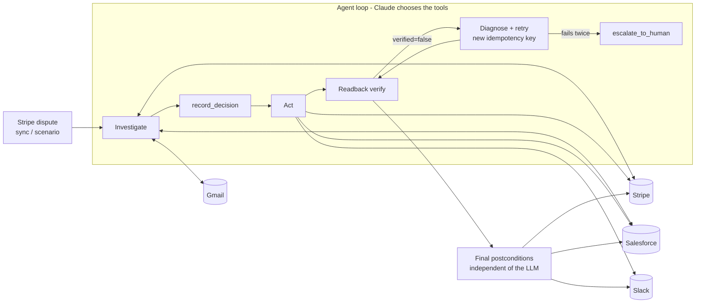

# Sentinel

When a customer tells their bank "I never got this", the bank pulls the money back and the store has about a week to prove otherwise. Sentinel handles that chargeback the way a careful ops person would: it reads the dispute in Stripe, looks the customer up in Salesforce, searches Gmail for anything they wrote, checks their dispute history, decides whether to fight, accept, or ask a person, takes the action in Stripe, Salesforce and Slack, and then reads every system back to confirm it actually happened. If a write silently didn't land, it notices, retries safely, or escalates.

## Decisions

| Branch | Evidence pattern | Action |
| --- | --- | --- |
| **FIGHT** | Delivery proof in CRM and/or the customer confirmed receipt by email, or Stripe records contradict the claim | Submit evidence to Stripe, post a Slack summary |
| **FIGHT + FLAG** | FIGHT, and ≥ 2 prior disputes in 90 days | FIGHT, plus flag the Salesforce contact, open a "Chargeback risk: repeat disputer" case, post to #risk |
| **ACCEPT** | Customer is provably right (e.g. canceled before the charge) | Accept in Stripe, cancel the active subscription, open a follow-up case, post to Slack. **Over $200 needs human approval first** |
| **ASK_HUMAN** | Not enough evidence either way | No Stripe action. "Evidence needed" case listing what's missing, Slack post with the due date |
| **EXPIRED / BLOCKED** | Deadline passed or dispute no longer `needs_response` | No Stripe action. Slack post explaining why |

## Architecture



- `src/agent/run.ts`: `generateText` tool loop (AI SDK v7), Lemma tracing, final verification, approval resume.
- `src/agent/tools.ts`: read tools, `record_evidence`, `record_decision`, action tools.
- `src/agent/policy.ts` guardrails in code · `src/agent/idempotency.ts` ledger and readback · `src/agent/chaos.ts` fault injection · `src/agent/verify.ts` postconditions.
- `src/adapters/*`: thin Stripe (official SDK over a logging fetch) and Salesforce/Gmail/Slack (REST over the same logging fetch). Every provider call lands on the case timeline.
- `src/eval/*`: seed, reset, harness, assertions, metrics.

## How reliability works

- **Policy in code.** No action before a recorded decision. Submit only on FIGHT branches while the dispute is `needs_response` and before `due_by`, both read live right before the write. Accept above $200 only after approval. Flag only with ≥ 2 prior disputes in 90 days. Max 2 attempts per action. Blocked calls never reach a provider.
- **Ledger.** One entry per case per action. A verified action is never sent again; duplicate model calls get the stored result. Stripe retries use a new idempotency key after a readback; Slack and Salesforce always look before writing.
- **Readback.** Every write is followed by reads of the provider. A 200 is not success.
- **Chaos.** `drop_submit_once` (evidence saved without `submit`), `stripe_500_once` (readback 500), `slack_timeout_once` (client gives up after 100 ms while the post lands). Shown as "Injected failure" in the UI.
- **Final verification.** After the loop, Sentinel reads Stripe, Salesforce and Slack and checks the end state the decision implies. Only then is a case `resolved`.

## How evaluation works

For each of eight scenarios (`src/domain/scenarios.ts`): reset the Arga twins → seed all four systems → ingest the dispute → run the agent (auto-approve where the scenario says) → assert against provider state read directly, not the case store. `npm run eval` writes `eval/results.json` and `eval/results.md`; the `/eval` page runs scenarios one request at a time.

Metrics: task success, decision accuracy, false-action rate, constraint-violation rate, recovery rate, state consistency, mean provider calls, mean wall time. The numbers live in `eval/results.md` after the harness runs against provisioned twins.

`npm test` checks the policy, ledger, chaos recovery, postconditions and assertions offline, with no provider or model.

## Sponsors

- **Arga Labs**: Stripe, Gmail, Slack and Salesforce twins; per-scenario seeding; `arga.twins.reset` between eval scenarios. See [arga/README.md](arga/README.md).
- **Lemma**: every agent run is traced with `vercelAI()` from `@uselemma/tracing`; the trace id shows on the case page.

## Run locally

```bash
npm install
cp .env.example .env.local   # Anthropic, Lemma, Arga twin and (optional) Upstash values
npm run twins:check          # one read per system
npm test                     # offline reliability checks
npm run agent -- --scenario receipt_confirmed_repeat
npm run agent -- --scenario chaos_drop_submit
npm run eval
npm run dev
```

## Deploy

Vercel, Next.js 15 App Router, Node runtime; long routes set `maxDuration = 300`. Add Upstash Redis from the Vercel Marketplace so case state is shared across function instances, set every `.env.example` variable, and set `APP_URL` to the production URL so Slack posts link to live case pages.

## Not built on purpose

Authentication, multi-merchant tenancy, settings, receipt/PDF parsing, carrier tracking APIs, a chat interface, emailing customers, Slack interactive approvals, a landing page, and the optional Stripe webhook route (Sync from Stripe is the ingestion path).
