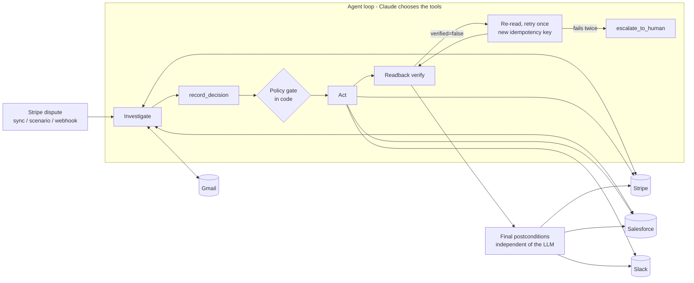

# Sentinel

When a customer tells their bank "I never got this", the bank pulls the money back and the store has about a week to prove otherwise. Sentinel handles that chargeback the way a careful ops person would: it reads the dispute in Stripe, looks the customer up in Salesforce, searches Gmail for anything they wrote, checks their dispute history, decides whether to fight, accept, or ask a person, takes the action in Stripe, Salesforce and Slack, and then reads every system back to confirm it actually happened. If a write silently didn't land, it notices, retries safely, or escalates.

Live: https://sentinel-orpin-psi.vercel.app (queue at `/disputes`, evaluation at `/eval`, sandbox state at `/sandbox`).

Demo video: https://drive.google.com/file/d/110fY93F8Uv2BTiRgcz8FQkKWG5Utj09n/view?usp=sharing

## Decisions

| Branch | Evidence pattern | Action |
| --- | --- | --- |
| **FIGHT** | Delivery record in Salesforce and/or the customer confirmed receipt by email, or Stripe records contradict the claim | Submit evidence to Stripe, post a Slack summary |
| **FIGHT + FLAG** | FIGHT, and ≥ 2 other disputes on the customer's charges in 90 days | FIGHT, plus `RISK_FLAG: friendly_fraud` on the contact, a "Chargeback risk: repeat disputer" case, a #risk post |
| **ACCEPT** | Customer is provably right (e.g. cancellation email before the charge) | Close the dispute, cancel an active subscription, open a "Dispute accepted" case, post to Slack. **Over $200 waits for a named human approval** |
| **ASK_HUMAN** | Not enough evidence either way | No Stripe action. "Evidence needed" case listing the gaps, Slack post with the due date |
| **EXPIRED / BLOCKED** | Deadline passed, `past_due`, or dispute no longer answerable | No Stripe action. Slack post explaining why |

## Architecture



- `src/agent/run.ts`: `generateText` tool loop (AI SDK v7, `claude-sonnet-5`), Lemma tracing, final verification, approval resume.
- `src/agent/tools.ts`: read tools, `record_evidence` (only refs a tool returned), `record_decision`, action tools.
- `src/agent/policy.ts` guardrails · `src/agent/idempotency.ts` ledger and readback · `src/agent/chaos.ts` fault injection · `src/agent/verify.ts` postconditions.
- `src/adapters/*`: Stripe (official SDK) and Salesforce/Gmail/Slack (REST), all over one logging fetch, so every provider call lands on the case timeline. Built from `docs/research/DATA-CONTRACT.md`.
- `src/eval/*`: seeding from `fixtures/scenarios`, twin provisioning and reset, assertions, metrics.
- `src/sandbox/server.ts`: Sentinel's Salesforce/Gmail/Slack sandbox (see below).

## Where the providers are

| System | Used for results | Why |
| --- | --- | --- |
| Stripe | **Real Stripe test mode** | The Arga Stripe twin cannot create disputes (Kill Check #1, evidence in `fixtures/live/`) |
| Salesforce, Gmail, Slack | **Arga twins** when quota is available; otherwise **Sentinel sandbox** | The Arga free plan allows one twin per run for 10 minutes, and this account's monthly runs are used up |

Results are stored and shown **per environment**: the Evaluation page has an "Arga twins" tab and a "Sandbox" tab, every case carries a badge, and `eval/results.json` keeps both separately. A sandbox run never replaces a twin result.

The sandbox serves the subset of the Salesforce, Gmail and Slack APIs that the adapters call, with the shapes observed on live twins. It runs locally (`npm run sandbox`) or inside the deployed app at `/api/sandbox/*` (state in Upstash Redis). Switch production with `npm run env:use -- sandbox` or `npm run provision && npm run env:use -- arga`.

## How reliability works

- **Policy in code.** No action before a recorded decision. Stripe writes only while the dispute is `needs_response`/`warning_needs_response`, not `past_due`, before `due_by`; evidence only with `submission_count == 0`. Accept over $200 only after recorded approval. Flag only with ≥ 2 other disputes in 90 days. Max 2 attempts per action. Blocked calls never reach a provider.
- **Ledger.** One entry per case per action; a verified action is never sent again. Idempotency keys are `sentinel:{dispute}:{action}:{attempt}`, and a retry re-reads first so a late-landing write is recognised instead of repeated. Slack and Salesforce look before writing.
- **Readback.** Evidence ⇒ `under_review` and `submission_count == 1`; accept ⇒ `lost`; Salesforce ⇒ re-read flag line and case count; Slack ⇒ `conversations.history` returns the posted `ts`. A 200 is never success on its own.
- **Chaos.** `drop_submit_once` (evidence saved as a draft, HTTP 200), `stripe_500_once`, `slack_timeout_once`. Shown as "Injected failure" in the UI.
- **Final verification.** After the loop, Sentinel reads Stripe, Salesforce and Slack itself. A case is `resolved` only if every check passes.

## How evaluation works

The eight scenarios are the research fixtures in `fixtures/scenarios/`. For each: reset the providers → seed Stripe, Salesforce, Gmail and Slack → ingest → run the agent (approve scenario 04) → evaluate every fixture `assertion` and `forbidden_effect` against provider state read directly, never the case store.

Latest committed results (`eval/results.md`):

| Environment | Task success | Decision accuracy | False actions | Constraint violations | Recovery | State consistency | Mean calls / time |
| --- | --- | --- | --- | --- | --- | --- | --- |
| Stripe test mode + Sentinel sandbox | 7/7 (100%) | 100% | 0% | 0% | 100% (1 chaos scenario) | 100% | 31 / 44 s |
| Stripe test mode + Arga twins | not run (quota) | — | — | — | — | — | — |

Scenario 08 (deadline passed) is skipped: Stripe test mode cannot create a dispute whose deadline is already past. The no-submit gate is covered by `npm test`. Scenario 07 also ran once end to end against live Arga twins: the dropped submit was detected and recovered (`docs/evidence/scenario-07-live-run.log`).

`npm test` checks adapters against fixture payloads, the policy gates, ledger and chaos recovery, postconditions, every fixture assertion mapping, and the real adapters over HTTP against the sandbox.

## Sponsors

- **Arga Labs**: Salesforce, Gmail and Slack twins (one run per twin on the Free plan), live API probes that shaped the adapters, `arga.twins.reset` between scenarios. See [arga/README.md](arga/README.md).
- **Lemma**: every run is one trace (`sentinel.dispute_run`, thread = dispute id) via `vercelAI()` from `@uselemma/tracing`, with explicit `verify.*` and `recovery.retry` spans. `npm run lemma:smoke` confirms delivery.

## Run locally

```bash
npm install
cp .env.example .env.local   # Anthropic, Lemma, Stripe test key, optional Upstash
npm test                     # offline checks
npm run sandbox              # terminal 1: Salesforce/Gmail/Slack sandbox on :4010
npm run dev                  # terminal 2: http://localhost:3000
npm run agent -- --scenario 07   # dropped submit, caught and recovered
npm run eval                     # all 8 scenarios
```

With Arga quota: delete `.env.development.local`, then `npm run provision` and `npm run twins:check -- --capture`.

## Deploy

Vercel, Next.js 15 App Router, Node runtime; long routes set `maxDuration = 300`. Upstash Redis (Vercel Marketplace) holds cases, results and hosted sandbox state. Every push to `main` deploys.

## Not built on purpose

Authentication, multi-merchant tenancy, settings, receipt/PDF parsing, carrier tracking APIs, a chat interface, emailing customers, Slack interactive approvals (approval is in the app), file evidence uploads.
